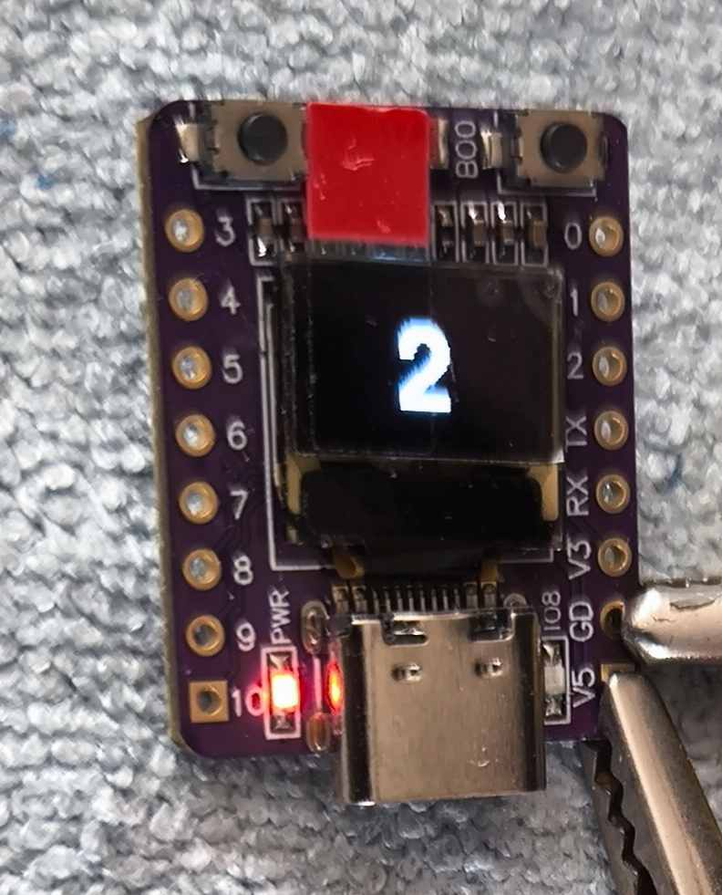
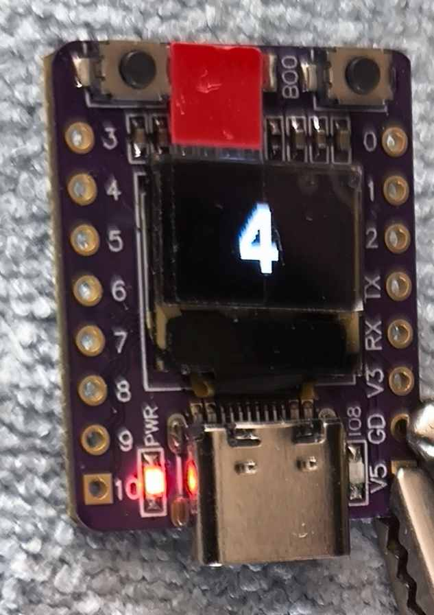
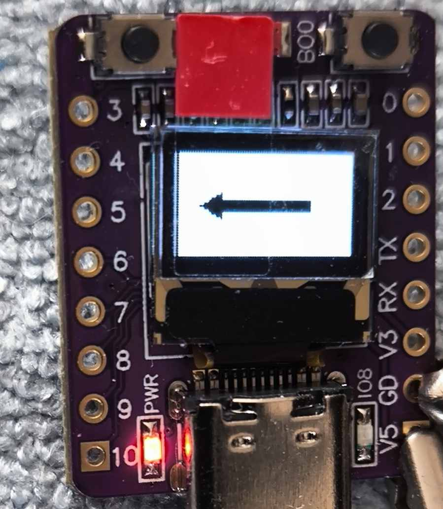
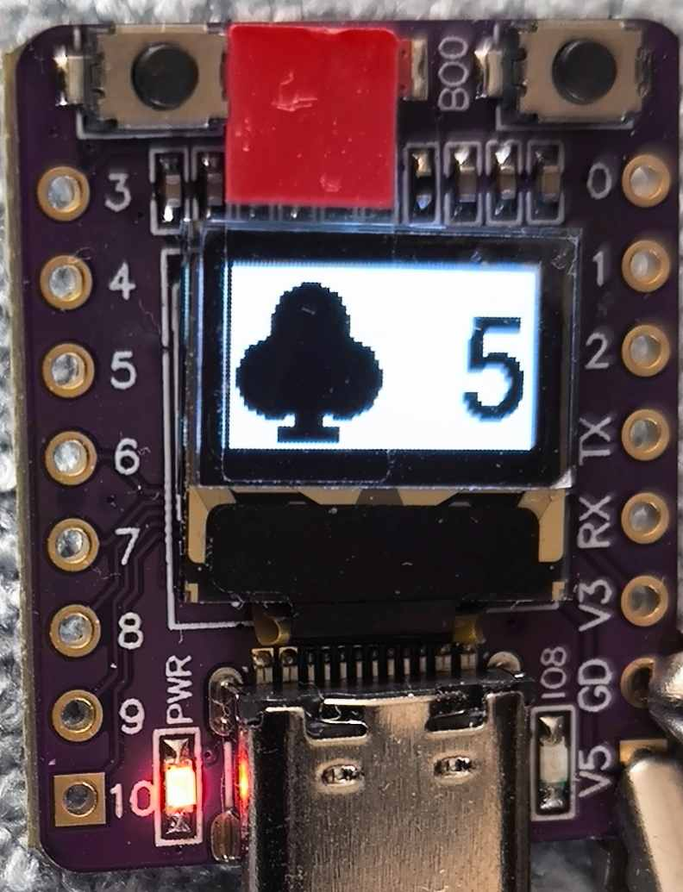
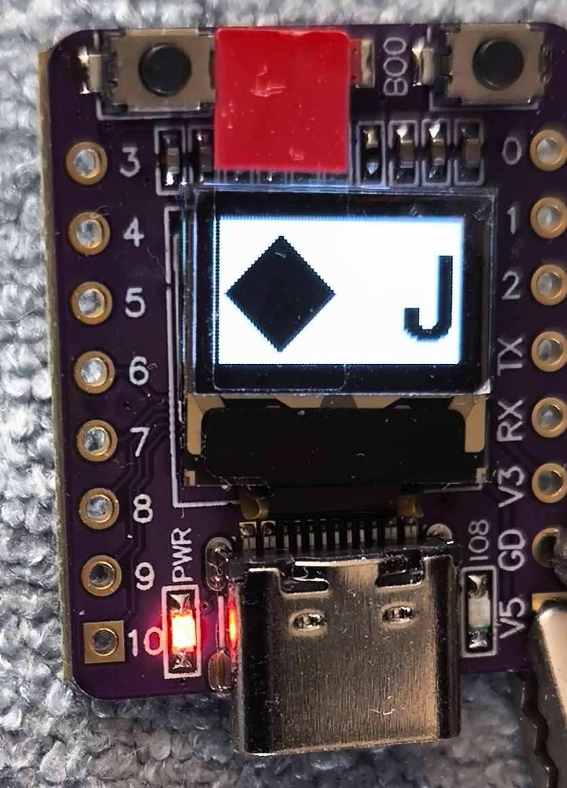
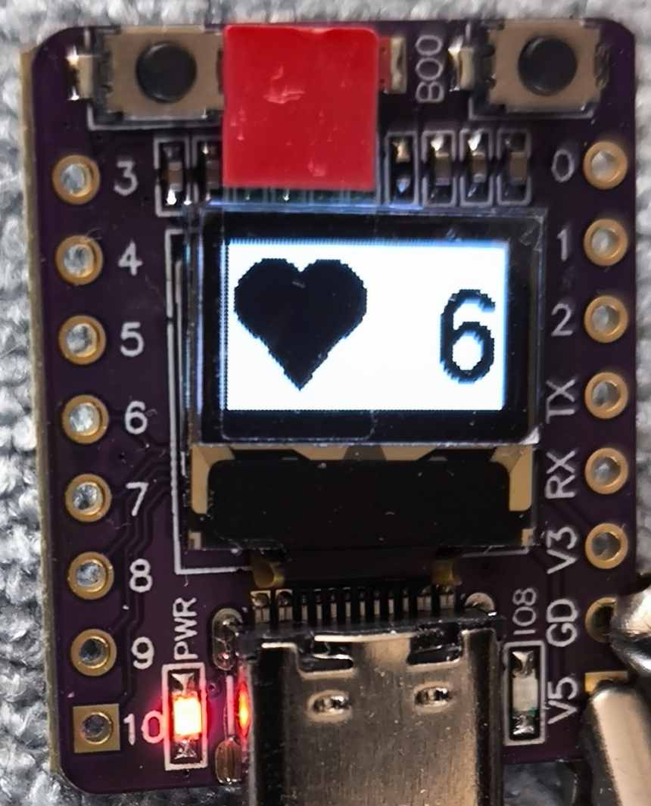
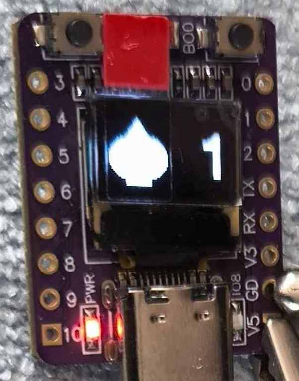
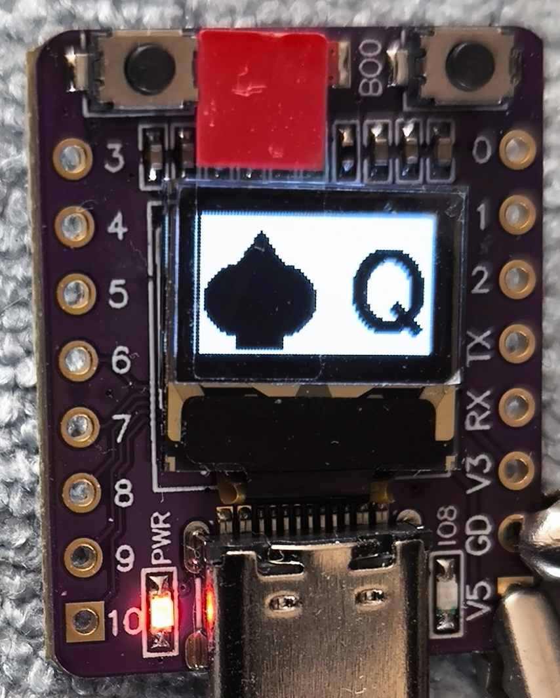
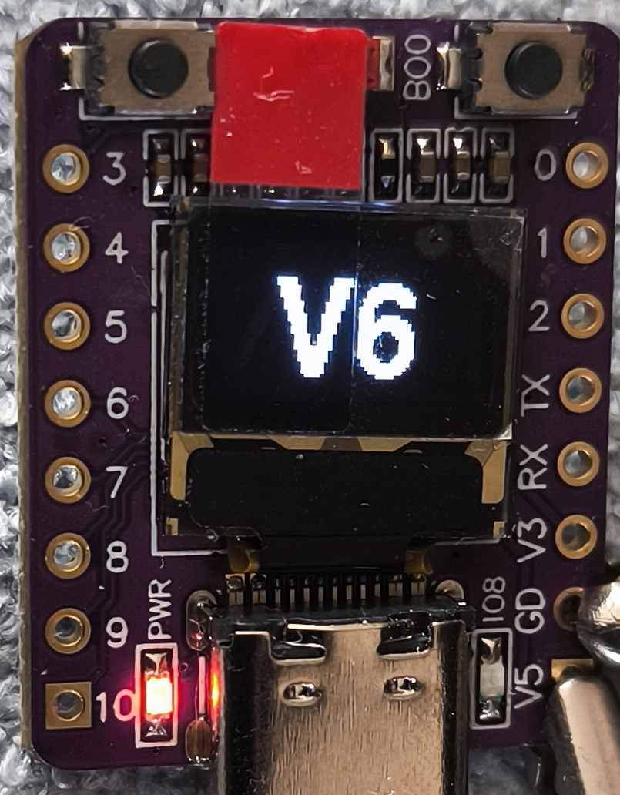

# The Stamp Size Diy Peek Device

Ein winziges Display, ein kleines ESP32-C3-Board und eine einfache Idee: Informationen unauffällig sichtbar machen, wenn man sie braucht. Dieses Projekt richtet sich besonders an Zauberer, Mentalisten und Bastler, die ein kleines technisches Hilfsmittel selbst bauen möchten, ohne schon vorher tief in Firmware, Bluetooth und Webentwicklung zu stecken.

Das Gerät zeigt kurze Hinweise auf einem sehr kleinen OLED-Display an. Das können Pfeile, Spielkarten, kurze Wörter oder einfache Symbole sein. Gesteuert wird es drahtlos über Bluetooth Low Energy. Dadurch kann das Display in einem Requisit, am Körper oder in einer Testsituation liegen, während die Steuerung von einem Smartphone, Browser-Client oder einer geeigneten BLE-App kommt.

## Worum es geht

`The Stamp Size Diy Peek Device` ist kein fertiges Kaufprodukt, sondern ein DIY-Projekt. Der Reiz liegt darin, ein kleines Gerät selbst zu bauen, zu verstehen und an die eigene Routine anzupassen.

Die Firmware `BlePrompter` macht aus dem ESP32-C3-OLED-Board ein kleines Bluetooth-Anzeigegerät. Der passende Web-Client bietet eine einfache Oberfläche für Pfeile, Karten und Symbole. Wer lieber mit Android-Apps oder Automatisierung arbeitet, kann dieselben Befehle auch über BLE-Tools oder MacroDroid senden.

## Bilder



















## Was das Gerät anzeigen kann

- kurze Texte
- einzelne Symbole oder Symbolpaare
- Pfeile in acht Richtungen
- Spielkarten inklusive Joker
- normale oder invertierte Anzeige

Das Display ist bewusst klein. Es eignet sich nicht für lange Nachrichten, sondern für klare, schnell erkennbare Hinweise. Genau das macht es für Vorführsituationen interessant.

## Einstieg für Einsteiger

Wenn du das Projekt zum ersten Mal öffnest, beginne mit der DIY-Anleitung:

[docs/DiyAnleitung.md](docs/DiyAnleitung.md)

Dort steht Schritt für Schritt, welches Material benötigt wird, wie die Firmware kompiliert wird, wie sie auf das Board kommt und wie der Client genutzt wird. Die Anleitung ist bewusst für Laien geschrieben.

## Für technische Details

Die README bleibt absichtlich grob. Projektstruktur, Firmware-Details, Bibliotheken, UUIDs, Build-Hinweise und fachliche Informationen liegen in der Projektübersicht:

[PROJEKTUEBERSICHT.md](PROJEKTUEBERSICHT.md)

Die Befehle für `BlePrompter` sind hier dokumentiert:

[BlePrompter/BEFEHLE.md](BlePrompter/BEFEHLE.md)

## Nutzungsidee

Typisch ist dieser Ablauf:

1. Firmware auf das ESP32-C3-OLED-Board laden.
2. Board einschalten.
3. Mit dem Web-Client oder einer BLE-App verbinden.
4. Einen vorbereiteten Befehl senden.
5. Das Display zeigt den gewünschten Hinweis.

Für Proben kann das ganz offen auf dem Tisch liegen. Für eine Routine kann es später in ein Requisit wandern oder mit einer Smartphone-Automatisierung kombiniert werden.

## Einbindung an bestehende Zauber-Apps

Viele moderne Zauber-Apps lassen sich nicht direkt mit eigener Hardware verbinden, bieten aber oft einen Ausgang über URL-Schemes, Webhooks, APIs oder Apple Kurzbefehle. Genau dort kann `BlePrompter` später andocken: Die Zauber-App erzeugt eine Information, eine kleine Zwischenstufe übersetzt diese Information in einen kurzen `BlePrompter`-Befehl, und das Gerät zeigt den Hinweis an.

Interessant sind besonders Apps und Werkzeuge, die Ausgaben an andere Systeme erlauben. Öffentlich auffindbare Hinweise gibt es zum Beispiel bei:

- [`Inject`](https://apps.apple.com/gb/app/inject-magic/id1028281720): Die App ist als Inject-Magic von Greg Rostami verfügbar. Öffentliche Integrationshinweise zeigen vor allem, dass externe Eingaben für bestimmte Routinen möglich sind, etwa über Bluetooth-Keyboard-ähnliche Steuerung.
- [`PinTrigger`](https://apps.apple.com/at/app/pintrigger-magic-app/id6747009047): Die App beschreibt URL-Schemes, Webhooks, API-Eingaben, Apple Shortcuts sowie Integrationen mit Diensten wie Make, Zapier, IFTTT und n8n.
- [`.inputrrr`](https://watchaware.com/watch-apps/inputrrr/6741680054): Die App-Beschreibung nennt Ausgaben über URL-Schemes und Shortcuts sowie direkte Integrationen mit verschiedenen Magic-Apps.
- [`NameForge`](https://www.heknows.co.uk/shop/nameforge/): Die Produktbeschreibung nennt ein URL-Scheme und die Ausgabe an Inject beziehungsweise Apps, die Inject als Eingabe akzeptieren.
- [`ACAAT`](https://spark.mwm.ai/en/apps/acaat/1513813745): Öffentlich beschriebene Funktionen nennen API- und Webhook-Integration sowie Inject-Output.

Für dieses Projekt bedeutet das: Sobald eine App eine Karte, ein Wort, eine Zahl oder eine Auswahl per URL, Webhook oder Shortcut ausgeben kann, lässt sich daraus prinzipiell ein Befehl wie `CHX`, `SYMBOL OK`, `ARROW NE` oder `TEXT Hallo` bauen.

### Android

Auf Android gibt es zwei naheliegende Wege: den vorhandenen `BlePrompterJsClient` im Browser oder eine Automatisierung über MacroDroid.

Der `BlePrompterJsClient` ist bereits eine funktionsfähige Client-Anwendung. Er läuft als Webseite, nutzt Web Bluetooth und sendet die passenden BLE-UART-Befehle direkt an das Gerät. Eine typische Anwendung wäre ein Helfer im Hintergrund: Der Helfer sieht oder erfährt während der Show eine Information, wählt im Client die passende Karte, Richtung oder ein Symbol aus, und der Zauberer bekommt den Hinweis diskret auf dem kleinen Display angezeigt. Auf Android ist dafür Chrome interessant. Wichtig ist nur, dass die Seite in einem sicheren Kontext geöffnet wird, also über HTTPS oder `localhost`.

Für Proben und erste Routinen ist dieser Ablauf am einfachsten:

1. `BlePrompter` auf dem ESP32-C3-OLED-Board starten.
2. Den `BlePrompterJsClient` auf dem Smartphone öffnen.
3. Im Browser auf `Verbinden` tippen.
4. Das Gerät `BlePrompter` auswählen.
5. Pfeile, Karten oder Symbole über die Oberfläche senden.

MacroDroid ist der zweite realistische Android-Weg. MacroDroid kann [Webhooks](https://www.macrodroidforum.com/wiki/index.php/Trigger%3A_Webhook_%28URL%29) und [HTTP-Anfragen](https://www.macrodroidforum.com/wiki/index.php/Action%3A_HTTP_Request) verarbeiten. Mit einem passenden BLE-Plugin oder einer kleinen Android-Zwischen-App kann daraus ein BLE-UART-Schreibvorgang an `BlePrompter` werden.

Ein möglicher Ablauf:

1. Zauber-App löst eine URL, einen Webhook oder eine Android-Aktion aus.
2. MacroDroid empfängt diese Information.
3. MacroDroid setzt daraus einen kurzen Textbefehl zusammen.
4. Ein BLE-Plugin oder eine kleine Hilfs-App schreibt den Befehl an die RX-Characteristic von `BlePrompter`.
5. Das OLED zeigt den gewünschten Hinweis.

Das ist besonders interessant für Routinen, bei denen eine bestehende App bereits eine Karte, eine Zahl oder einen Text kennt, diese Information aber zusätzlich diskret auf dem kleinen Display erscheinen soll.

### Windows

Unter Windows ist der `BlePrompterJsClient` ebenfalls der wichtigste Einstieg. Er kann lokal aus dem Repository gestartet werden und läuft dann als kleine Webanwendung im Browser. Für Windows ist das besonders praktisch, weil keine native Desktop-App gebaut werden muss. Auch hier passt das Helfer-Szenario gut: Eine Person abseits der Bühne bedient den Client am Laptop und versorgt den Zauberer während der Vorführung mit kurzen, versteckten Informationen.

Der Client liegt hier:

[BlePrompterJsClient](BlePrompterJsClient)

Der lokale Demo-Server wird so gestartet:

```powershell
BlePrompterJsClient\start-demo-server.bat
```

Danach kann die Oberfläche im Browser geöffnet werden:

```text
https://localhost:8443/
```

Auf Windows ist dieser Weg vor allem für Entwicklung, Tests und Proben nützlich. Man kann die Firmware auf das Board laden, den Client im Browser öffnen und sofort prüfen, ob die BLE-Verbindung und die Anzeige funktionieren.

Für bestehende Zauber-Apps oder externe Tools gibt es unter Windows außerdem einen gut testbaren Brücken-Ansatz:

1. Eine App, ein Skript oder ein Webhook erzeugt einen kurzen `BlePrompter`-Befehl.
2. Ein lokaler Prozess auf Windows nimmt diesen Befehl entgegen.
3. Der Prozess sendet ihn per Web Bluetooth, BLE-Bibliothek oder später über eine kleine lokale Client-Erweiterung an `BlePrompter`.

Das ist technisch aufwendiger als die direkte Bedienung im Browser, aber für komplexere Routinen interessant. Besonders praktisch wäre später ein kleiner lokaler HTTP-Endpunkt, der Befehle wie `CHX` annimmt und an das verbundene Gerät weiterleitet.

### iOS

Für iOS ist die Idee ähnlich, aber die technische Umsetzung ist stärker eingeschränkt. Apple Kurzbefehle können [über ein URL-Scheme mit Text gestartet werden](https://support.apple.com/guide/shortcuts/run-a-shortcut-from-a-url-apd624386f42/ios). Eine andere App kann also prinzipiell einen Kurzbefehl mit einem Parameter wie `CHX` oder `TEXT Hallo` aufrufen.

Wichtig: Kurzbefehle allein sind nach aktuellem Kenntnisstand kein vollständiger Ersatz für eine BLE-UART-App. Für das eigentliche Schreiben an eine BLE-Characteristic braucht es eine App, die CoreBluetooth nutzt oder selbst eine passende Kurzbefehle-Aktion bereitstellt.

Mögliche iOS-Wege:

- Eine Magic-App ruft einen Kurzbefehl auf, der den Text vorbereitet und an eine BLE-Helfer-App übergibt.
- Eine App wie [Bluetooth Inspector](https://apps.apple.com/de/app/bluetooth-inspector/id1509085044?l=en) wird als BLE-Helfer genutzt. Der App-Store-Verlauf nennt eine Kurzbefehle-Aktion `Write Value`, die Strings oder Zahlen an eine beschreibbare BLE-Characteristic senden kann. Das passt grundsätzlich zum `BlePrompter`-Prinzip: Der Kurzbefehl erzeugt zum Beispiel `CHX`, `SYMBOL OK` oder `TEXT Hallo` und die Helfer-App schreibt diesen Text an die RX-Characteristic.
- Eine BLE-Terminal-App wie [Bluefruit Connect](https://apps.apple.com/gb/app/bluefruit-connect/id830125974) oder [BLE Hero](https://apps.apple.com/us/app/ble-hero/id1013013325) wird genutzt, um Befehle manuell oder über vorbereitete Textbausteine an `BlePrompter` zu senden.
- Eine kleine eigene iOS-App nutzt [CoreBluetooth](https://developer.apple.com/documentation/corebluetooth/transferring-data-between-bluetooth-low-energy-devices), verbindet sich mit `BlePrompter` und akzeptiert Eingaben über URL-Scheme oder Kurzbefehle.
- Eine Webhook-fähige Magic-App sendet die Information an einen kleinen Server. Dieser Server leitet sie an ein Android-Gerät, einen PC oder einen Raspberry Pi weiter, der dann die BLE-Verbindung zum `BlePrompter` übernimmt.

Ein sinnvoller iOS-Test wäre:

1. `BlePrompter` einschalten.
2. In Bluetooth Inspector das Gerät suchen und die Services auslesen.
3. Die Nordic-UART-RX-Characteristic `6E400002-B5A3-F393-E0A9-E50E24DCCA9E` als Ziel für `Write Value` verwenden.
4. Einen Kurzbefehl bauen, der einen Textparameter annimmt und diesen an die Characteristic schreibt.
5. Den Kurzbefehl per URL-Scheme aus einer Magic-App oder aus einem zweiten Kurzbefehl starten.

Da hier kein iOS-Testgerät genutzt wird, sind diese Punkte als Integrationsideen zu verstehen. Der Weg über Bluetooth Inspector ist aber konkreter als eine rein eigene App, weil die Kurzbefehle-Aktion zum Schreiben von BLE-Werten bereits öffentlich beschrieben ist.

## Aktueller Schwerpunkt

Der aktuelle Schwerpunkt liegt auf:

- stabiler BLE-Steuerung
- gut lesbarer OLED-Ausgabe
- einfacher Bedienung über Web-Bluetooth
- verständlicher Dokumentation für Menschen, die nicht täglich Software bauen

Das Projekt ist damit eine Grundlage zum Weiterbauen. Es soll nicht nur funktionieren, sondern auch nachvollziehbar bleiben.

## Unterstützung

Wenn dir dieses Projekt hilft, eine eigene Idee, Probe oder Routine umzusetzen, kannst du die Weiterentwicklung später gern unterstützen. Typische Wege wären:

- ein PayPal-Spendenlink
- eine `Buy Me a Coffee`-Seite
- GitHub Sponsors
- ein kurzer Hinweis, wo und wie du das Projekt eingesetzt hast

Ein passender Spendenhinweis könnte später so aussehen:

```text
Wenn dir The Stamp Size Diy Peek Device geholfen hat, freue ich mich über einen Kaffee:
https://www.buymeacoffee.com/<dein-name>
```

Oder als PayPal-Variante:

```text
Unterstützung per PayPal:
https://paypal.me/<dein-name>
```

Noch sind hier keine echten Zahlungslinks eingetragen. Das ist Absicht, damit keine Platzhalter versehentlich als funktionierende Spendenziele verstanden werden.
