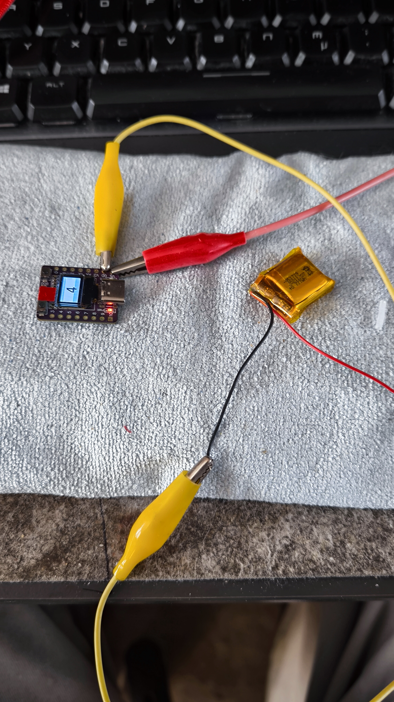
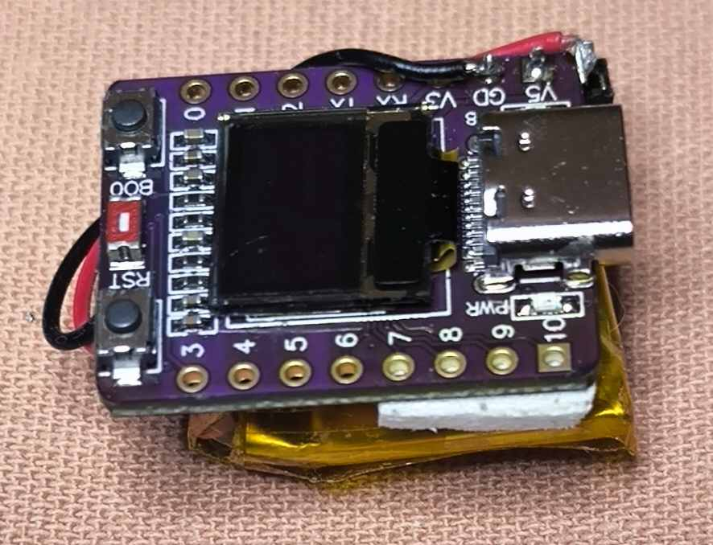
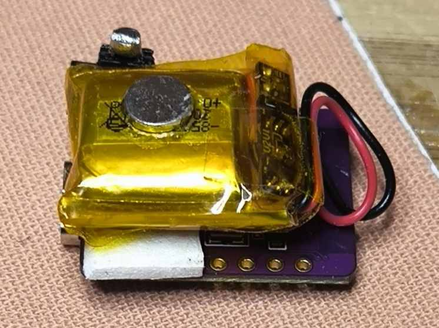
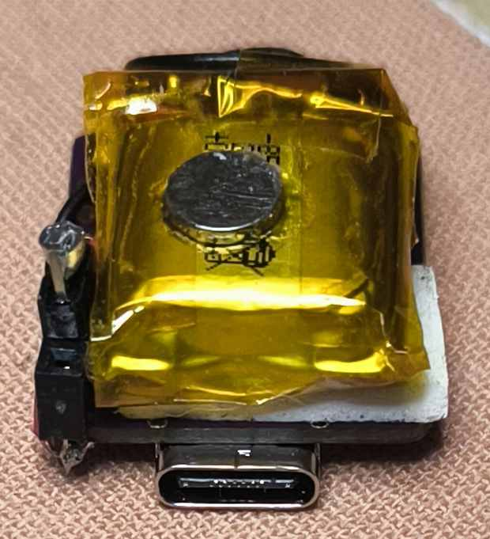
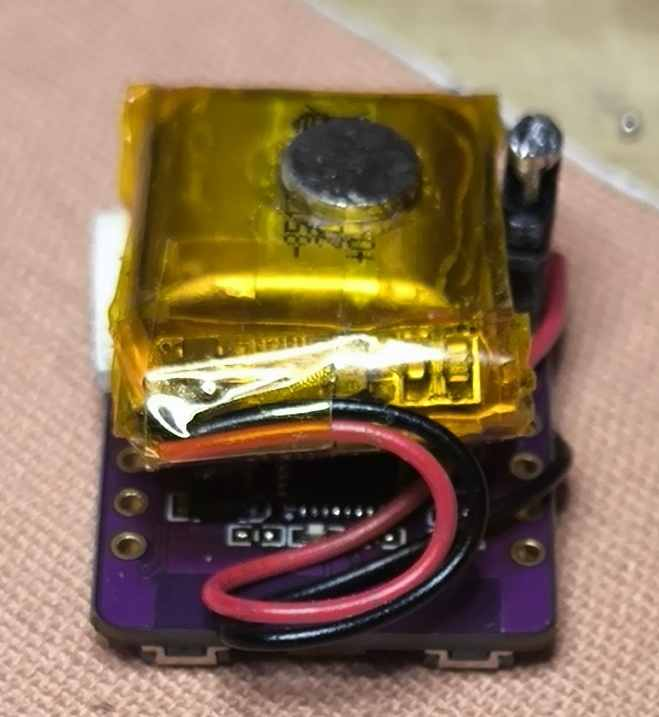
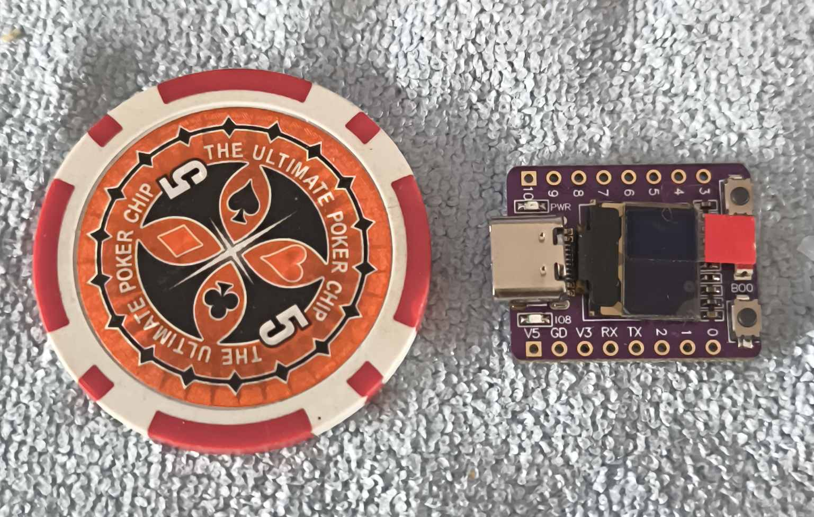
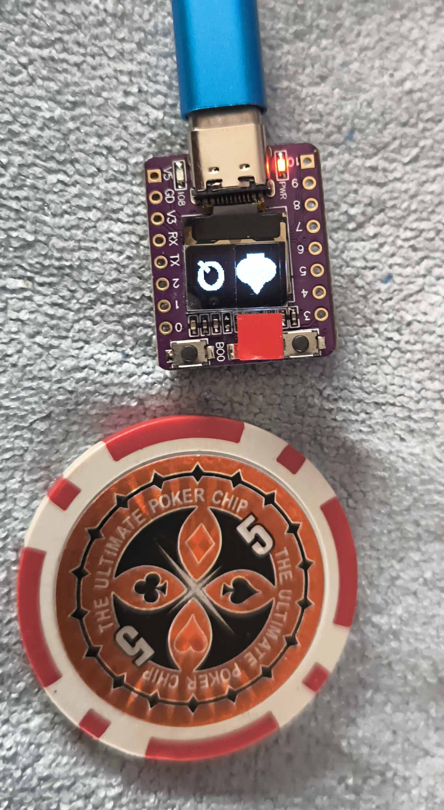
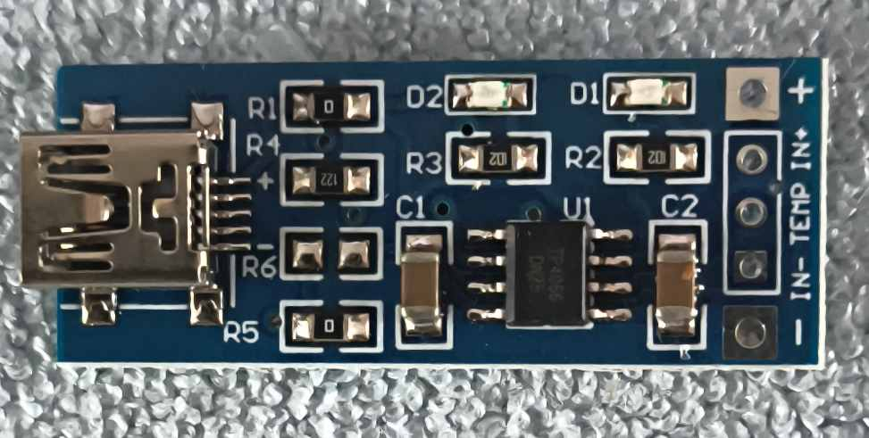

# The Stamp Size Diy Peek Device

Ein winziges Display, ein kleines ESP32-C3-Board und eine einfache Idee: Informationen unauffällig sichtbar machen, wenn man sie braucht. Dieses Projekt richtet sich besonders an Zauberer, Mentalisten und Bastler, die ein kleines technisches Hilfsmittel selbst bauen möchten, ohne schon vorher tief in Firmware und Bluetooth zu stecken.

Das Gerät zeigt kurze Hinweise auf einem sehr kleinen OLED-Display an. Das können Pfeile, Spielkarten, kurze Wörter oder einfache Symbole sein. Gesteuert wird es drahtlos über Bluetooth Low Energy. Dadurch kann das Display in einem Requisit, am Körper oder in einer Testsituation liegen, während die Steuerung von einem Smartphone oder einer geeigneten BLE-App kommt.

## Worum es geht

`The Stamp Size Diy Peek Device` ist kein fertiges Kaufprodukt, sondern ein DIY-Projekt. Der Reiz liegt darin, ein kleines Gerät selbst zu bauen, zu verstehen und an die eigene Routine anzupassen.

Die Firmware `BlePrompter` macht aus dem ESP32-C3-OLED-Board ein kleines Bluetooth-Anzeigegerät. Die Steuerung erfolgt über BLE-UART-fähige Apps, BLE-Tools oder MacroDroid mit passendem BLE-Plugin.

## Bilder

Die Bilder sind als kleine Vorschau angelegt. Ein Klick auf ein Bild öffnet die größere Originaldatei.

Hinweis: Auf den Board-Fotos ist auf dem OLED-Display noch die Schutzfolie angebracht. Das rote Quadrat oberhalb des Displays gehört zu dieser Folie und ist kein Bauteil des fertigen Geräts.

| | | | |
| --- | --- | --- | --- |
|  Anzeige ASCII-Symbol. |  Anzeige ASCII-Symbol. |  Anzeige Pfeil auf invertiertem Hintergrund. |  Anzeige Spielkarte "Clubs 5". |
|  Anzeige Spielkarte "Diamonds Jack". |  Anzeige Spielkarte "Hearts 6". |  Anzeige Spielkarte "Spades Ace". |  Anzeige Spielkarte "Spades Queen", invertiert. |
|  Anzeige ASCII 2 Stellen. |  Basis "Betrieb" Akku und Board. |  Prototyp final mit Akku. |  Prototyp final mit Akku und Magnet. |
|  Prototyp final mit Akku, Magnet und USB-Port. |  Prototyp final mit Akku, Magnet und USB-Port. |  Größenvergleich Pokerchip "Dollarsize". |  Größenvergleich Pokerchip "Dollarsize". |
|  Externer Ladeadapter. |  |  |  |

## Was das Gerät anzeigen kann

- einzelne Symbole oder Symbolpaare
- Pfeile in acht Richtungen
- Spielkarten inklusive Joker
- normale oder invertierte Anzeige
- kurze Texte, in der Praxis wegen der kleinen Schrift eher für kurze Hinweise geeignet
- TBD: weitere Symbole oder kleine Bilder. Der Code liegt vor und kann nach eigenem Bedarf erweitert werden.
- TBD: Tastenfunktionen. Auf dem Board steht eine Taste zur Verfügung, die später für Rückmeldungen oder Blätterfunktionen genutzt werden könnte.

Das Display ist bewusst klein. Es eignet sich nicht für lange Nachrichten, sondern für klare, schnell erkennbare Hinweise. Genau das macht es für Vorführsituationen interessant.

## Einstieg für Einsteiger

Wenn du das Projekt zum ersten Mal umsetzen möchtest, beginne mit der DIY-Anleitung:

[docs/DiyAnleitung.md](docs/DiyAnleitung.md)

Dort steht Schritt für Schritt, welches Material benötigt wird, wie die Firmware kompiliert wird, wie sie auf das Board kommt und wie das Gerät mit einer BLE-App getestet wird. Die Anleitung ist bewusst für Laien geschrieben.

## Kostenübersicht / Quellen

Der hier vorgestellte Prototyp nutzt folgende Materialquellen. Preise sind nur grobe Richtwerte und können sich je nach Händler, Versand und Verfügbarkeit ändern.

- Board, ca. 5 Euro
  - Amazon: https://www.amazon.de/Entwicklungsboard%EF%BC%8Cmit-0-42inch-Unterst%C3%BCtzt-Bluetooth-Sensornetzwerke/dp/B0FGPRSCNH
  - AliExpress, dort wurde das Board für diesen Prototyp gekauft: https://de.aliexpress.com/item/1005009157602185.html?spm=a2g0o.order_list.order_list_main.263.7f925c5f3yhoAs&gatewayAdapt=glo2deu
- Akku, ca. 0,50 Euro pro Stück
  - Zum Zeitpunkt des Projekts war der Akku bei Pollin in Deutschland sehr günstig erhältlich: https://www.pollin.de/p/lithium-polymer-akku-882734p-3-7-v-780-mah-5-stueck-273708
  - Hinweis: Der Akku ist mit 80 mAh angegeben, der Aufdruck nennt 77 mAh.
- Ladeadapter, ca. 2 Euro
  - Pollin: https://www.pollin.de/p/daypower-lademodul-fuer-lithium-akkus-m-ll-tp4056-351427
- Kleinteile, grob 2 Euro aus der Bastelkiste
  - Stiftleisten
  - USB-Kabel für den Ladeadapter
  - 16-kOhm-Widerstand für den Umbau des Ladeadapters

Optional kann das Projekt mit einer Lösung wie `Ring of Invisibility` von Marcus Anthony kombiniert werden. Dafür fallen zusätzliche Materialkosten von ungefähr 15 Euro für den Ring sowie 5 US-Dollar für den Trick bei Penguin Magic an: https://www.penguinmagic.com/p/21489

Hinweis: Auch wenn im Demo-Video möglicherweise die Funktionsweise des Rings sichtbar wird, kauft bitte den Trick bei Marcus. Die 5 Euro tun niemandem weh. Danke.

### Gesamtkosten ohne den Ring

Mit den genannten Quellen liegen die Gesamtkosten ohne Ring unter 10 Euro. Falls die günstigen Akkus nicht mehr erhältlich sind, sind eher ungefähr 15 Euro realistisch.

## Für technische Details

Die README bleibt absichtlich grob. Projektstruktur, Firmware-Details, Bibliotheken, UUIDs, Build-Hinweise und fachliche Informationen liegen in der Projektübersicht:

[PROJEKTUEBERSICHT.md](PROJEKTUEBERSICHT.md)

Die Befehle für `BlePrompter` sind hier dokumentiert:

[BlePrompter/BEFEHLE.md](BlePrompter/BEFEHLE.md)

## Nutzungsidee

Typisch ist dieser Ablauf:

1. Firmware auf das ESP32-C3-OLED-Board laden.
2. Board einschalten.
3. Mit einer BLE-App verbinden.
4. Einen vorbereiteten Befehl senden.
5. Das Display zeigt den gewünschten Hinweis.

Für Proben kann das ganz offen auf dem Tisch liegen. Für eine Routine kann es später in ein Requisit wandern oder mit einer Smartphone-Automatisierung kombiniert werden.

## Einbindung an bestehende Zauber-Apps

Viele moderne Zauber-Apps lassen sich nicht direkt mit eigener Hardware verbinden, bieten aber oft einen Ausgang über URL-Schemes, Webhooks, APIs oder Apple Kurzbefehle. Genau dort kann `BlePrompter` später andocken: Die Zauber-App erzeugt eine Information, eine kleine Zwischenstufe übersetzt diese Information in einen kurzen `BlePrompter`-Befehl, und das Gerät zeigt den Hinweis an.

Interessant sind besonders Apps und Werkzeuge, die Ausgaben an andere Systeme erlauben. Öffentlich auffindbare Hinweise gibt es zum Beispiel bei:

- [`Inject`](https://apps.apple.com/gb/app/inject-magic/id1028281720): Die App ist als Inject-Magic von Greg Rostami verfügbar. Öffentliche Integrationshinweise zeigen vor allem, dass externe Eingaben für bestimmte Routinen möglich sind, etwa über Bluetooth-Keyboard-ähnliche Steuerung.
- [`PinTrigger`](https://apps.apple.com/at/app/pintrigger-magic-app/id6747009047): Die App beschreibt URL-Schemes, Webhooks, API-Eingaben, Apple Shortcuts sowie Integrationen mit Diensten wie Make, Zapier, IFTTT und n8n.
- [`.inputrrr`](https://watchaware.com/watch-apps/inputrrr/6741680054): Die App-Beschreibung nennt Ausgaben über URL-Schemes und Shortcuts sowie direkte Integrationen mit verschiedenen Magic-Apps.
- [`NameForge`](https://www.heknows.co.uk/shop/nameforge/): Die Produktbeschreibung nennt ein URL-Scheme und die Ausgabe an Inject beziehungsweise Apps, die Inject als Eingabe akzeptieren.
- [`ACAAT`](https://spark.mwm.ai/en/apps/acaat/1513813745): Öffentlich beschriebene Funktionen nennen API- und Webhook-Integration sowie Inject-Output.

Für dieses Projekt bedeutet das: Sobald eine App eine Karte, ein Wort, eine Zahl oder eine Auswahl per URL, Webhook oder Shortcut ausgeben kann, lässt sich daraus prinzipiell ein Befehl wie `CHX`, `SYMBOL OK`, `ARROW NE` oder `TEXT Hallo` bauen.

### Android

Auf Android gibt es zwei naheliegende Wege: eine BLE-UART-App für manuelle Befehle oder eine Automatisierung über MacroDroid.

Für Proben und erste Routinen ist dieser Ablauf am einfachsten:

1. `BlePrompter` auf dem ESP32-C3-OLED-Board starten.
2. Eine BLE-UART-App wie nRF Connect oder Serial Bluetooth Terminal öffnen.
3. Das Gerät `BlePrompter` auswählen.
4. Den Nordic UART Service öffnen.
5. Befehle wie `CHX`, `ARROW NE`, `SYMBOL OK` oder `CL` an die RX-Characteristic senden.

MacroDroid ist der zweite realistische Android-Weg. MacroDroid kann [Webhooks](https://www.macrodroidforum.com/wiki/index.php/Trigger%3A_Webhook_%28URL%29) und [HTTP-Anfragen](https://www.macrodroidforum.com/wiki/index.php/Action%3A_HTTP_Request) verarbeiten. Mit einem passenden BLE-Plugin oder einer kleinen Android-Zwischen-App kann daraus ein BLE-UART-Schreibvorgang an `BlePrompter` werden.

Ein möglicher Ablauf:

1. Zauber-App löst eine URL, einen Webhook oder eine Android-Aktion aus.
2. MacroDroid empfängt diese Information.
3. MacroDroid setzt daraus einen kurzen Textbefehl zusammen.
4. Ein BLE-Plugin oder eine kleine Hilfs-App schreibt den Befehl an die RX-Characteristic von `BlePrompter`.
5. Das OLED zeigt den gewünschten Hinweis.

Das ist besonders interessant für Routinen, bei denen eine bestehende App bereits eine Karte, eine Zahl oder einen Text kennt, diese Information aber zusätzlich diskret auf dem kleinen Display erscheinen soll.

### Windows

Unter Windows ist das Projekt vor allem für Entwicklung, Build, Upload und serielle Diagnose nützlich. Für die eigentliche BLE-Steuerung bleibt ein Smartphone mit BLE-App derzeit der einfachste Weg.

Für bestehende Zauber-Apps oder externe Tools gibt es unter Windows außerdem einen gut testbaren Brücken-Ansatz:

1. Eine App, ein Skript oder ein Webhook erzeugt einen kurzen `BlePrompter`-Befehl.
2. Ein lokaler Prozess auf Windows nimmt diesen Befehl entgegen.
3. Der Prozess sendet ihn per BLE-Bibliothek oder über eine kleine lokale Hilfsanwendung an `BlePrompter`.

Das ist technisch aufwendiger als die direkte Bedienung per Smartphone-App, aber für komplexere Routinen interessant. Besonders praktisch wäre später ein kleiner lokaler HTTP-Endpunkt, der Befehle wie `CHX` annimmt und an das verbundene Gerät weiterleitet.

### iOS

Für iOS ist die Idee ähnlich, aber die technische Umsetzung ist stärker eingeschränkt. Apple Kurzbefehle können [über ein URL-Scheme mit Text gestartet werden](https://support.apple.com/guide/shortcuts/run-a-shortcut-from-a-url-apd624386f42/ios). Eine andere App kann also prinzipiell einen Kurzbefehl mit einem Parameter wie `CHX` oder `TEXT Hallo` aufrufen.

Wichtig: Kurzbefehle allein sind nach aktuellem Kenntnisstand kein vollständiger Ersatz für eine BLE-UART-App. Für das eigentliche Schreiben an eine BLE-Characteristic braucht es eine App, die CoreBluetooth nutzt oder selbst eine passende Kurzbefehle-Aktion bereitstellt.

Mögliche iOS-Wege:

- Eine Magic-App ruft einen Kurzbefehl auf, der den Text vorbereitet und an eine BLE-Helfer-App übergibt.
- Eine App wie [Bluetooth Inspector](https://apps.apple.com/de/app/bluetooth-inspector/id1509085044?l=en) wird als BLE-Helfer genutzt. Der App-Store-Verlauf nennt eine Kurzbefehle-Aktion `Write Value`, die Strings oder Zahlen an eine beschreibbare BLE-Characteristic senden kann. Das passt grundsätzlich zum `BlePrompter`-Prinzip: Der Kurzbefehl erzeugt zum Beispiel `CHX`, `SYMBOL OK` oder `TEXT Hallo` und die Helfer-App schreibt diesen Text an die RX-Characteristic.
- Eine BLE-Terminal-App wie [Bluefruit Connect](https://apps.apple.com/gb/app/bluefruit-connect/id830125974) oder [BLE Hero](https://apps.apple.com/us/app/ble-hero/id1013013325) wird genutzt, um Befehle manuell oder über vorbereitete Textbausteine an `BlePrompter` zu senden.
- Eine kleine eigene iOS-App nutzt [CoreBluetooth](https://developer.apple.com/documentation/corebluetooth/transferring-data-between-bluetooth-low-energy-devices), verbindet sich mit `BlePrompter` und akzeptiert Eingaben über URL-Scheme oder Kurzbefehle.
- Eine Webhook-fähige Magic-App sendet die Information an einen kleinen Server. Dieser Server leitet sie an ein Android-Gerät, einen PC oder einen Raspberry Pi weiter, der dann die BLE-Verbindung zum `BlePrompter` übernimmt.

Ein sinnvoller iOS-Test wäre:

1. `BlePrompter` einschalten.
2. In Bluetooth Inspector das Gerät suchen und die Services auslesen.
3. Die Nordic-UART-RX-Characteristic `6E400002-B5A3-F393-E0A9-E50E24DCCA9E` als Ziel für `Write Value` verwenden.
4. Einen Kurzbefehl bauen, der einen Textparameter annimmt und diesen an die Characteristic schreibt.
5. Den Kurzbefehl per URL-Scheme aus einer Magic-App oder aus einem zweiten Kurzbefehl starten.

Da hier kein iOS-Testgerät genutzt wird, sind diese Punkte als Integrationsideen zu verstehen. Der Weg über Bluetooth Inspector ist aber konkreter als eine rein eigene App, weil die Kurzbefehle-Aktion zum Schreiben von BLE-Werten bereits öffentlich beschrieben ist.

## Aktueller Schwerpunkt

Der aktuelle Schwerpunkt liegt auf:

- stabiler BLE-Steuerung
- gut lesbarer OLED-Ausgabe
- einfacher Bedienung über BLE-Apps und Makros
- verständlicher Dokumentation für Menschen, die nicht täglich Software bauen

Das Projekt ist damit eine Grundlage zum Weiterbauen. Es soll nicht nur funktionieren, sondern auch nachvollziehbar bleiben.

## Roadmap / TBD

Offene Punkte, die noch beschrieben oder umgesetzt werden sollen:

- TBD: Das Board besitzt keinen eigenen Ladeadapter für den kleinen Akku. Zum Laden wird ein externer, handelsüblicher Ladeadapter genutzt, der für den verwendeten kleinen Akku angepasst werden muss. Die Beschreibung dieses Umbaus folgt noch.

## Unterstützung / Buy Me a Coffee

Wenn dir `The Stamp Size Diy Peek Device` hilft, eine eigene Idee, einen Effekt oder eine Routine umzusetzen, freue ich mich über Unterstützung:

[Buy Me a Coffee](https://buymeacoffee.com/hesspet)
